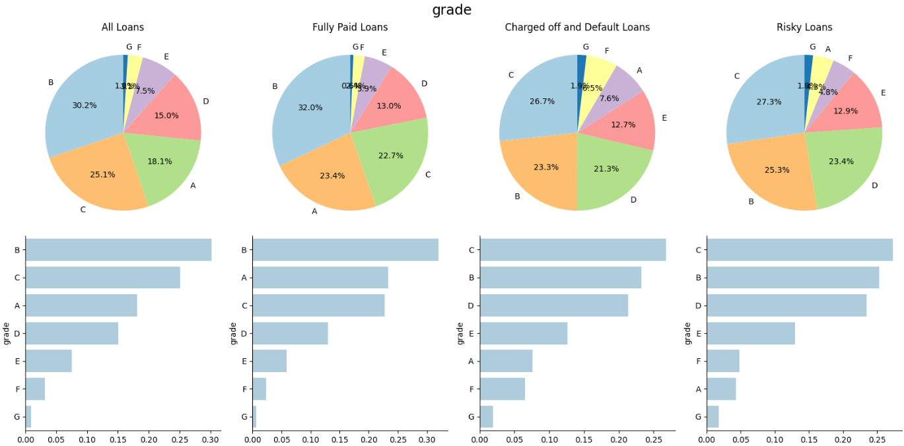
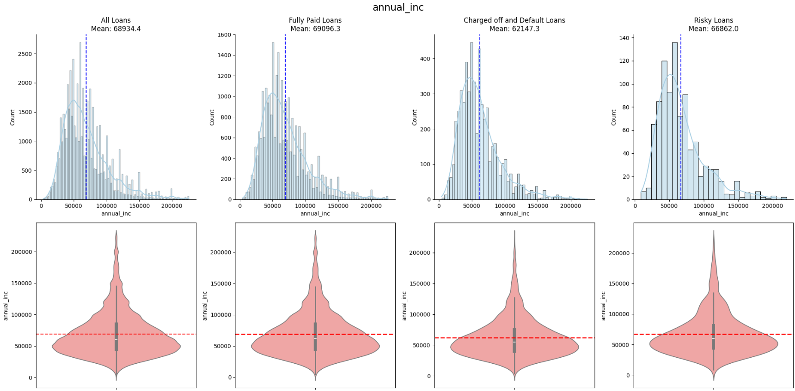

# Exploratory Data Analysis: Customer Loans in Finance
By **Joel Sud**
## Table of Contents:
- [Description](#description)
    - [Key Insights](#key-insights)
- [Installation Instructions](#installation-instructions)
- [Usage Instructions](#usage-instructions)
- [File Structure](#file-structure)
    - [File Description](#understanding-the-files)
- [Project Documentation](#project-documentation)

## Description: 
This is an Ai Core project with the aim of conducting Exploratory Data Analysis (EDA) on tabular customer loan payments data. This involves extracting the data from an AWS Relational Database and writing it to a pandas dataframe and a csv file ready for processing and analysis. 

This data is then transformed to impute and remove nulls, optimise skewness, remove outliers and identify correlation. Analysis and visualisation is then performed on this data to gain insights on the current state of loans, current and potential losses as well as identifying indicators of risk.

Here are some examples of the types of visualisations produced from the EDA:

### Key insights:

Here are some of the key insights from the EDA process:

- 90 % of all funded amounts have been recovered.
- Collections over the next 6 months will recover 18 % of all loans and 120 % of currently outstanding loan amounts (cover all currently outsanding funds).
- 1 in every 10 loans is 'Charged Off'.
- under 50 % of 'Charged Off' loan funds issued were recovered, if these loans had been fully paid then they would have generated 70 million additional revenue.
- 5 % of current loans are deemed 'Risky' or behind on payments, which has a potential loss of 9 million.
- Grade 'A' loans are safest, grade 'D' and 'E' should be issued with caution.
- 60 month terms are riskier than average.
- Renters pose slightly greater risk than mortgage payers.
- 'Charged Off' and 'Defaulted' loan customers have a 10 % lower average income than fully paid off loans.
- The lower the interest rates, loan amounts and monthly instalment amounts, the lower the risk of loss.
- 'Dti' is positively correlated with risk of loss.

## Installation Instructions:
1. **Download and clone repository:**
- copy the repository URL by clicking '*<> Code*' above the list of files in GitHub Repo. Then copy and paste the '*HTTPS*' URL:
- in your CLI go to the location where you wish to clone your directory.
- Type the following '***git clone***' command with the '*HTTPS*' URL:

***
git clone https://github.com/joelsud18/exploratory-data-analysis---customer-loans-in-finance.git***

- Press 'Enter'.

2. **Ensure there is the '*environment.yaml*' file.** This will be used to clone the conda environment with all the packages and versions needed to run the code in this repository. Using conda on the CLI on your machine write the following command:

***
conda env create -f environment.yml***

    
- you can add the ***--name*** flag to give a name to this environment.

## Usage Instructions
1. First ensure the appropriate conda environment is set up.
2. Run the '*db_utils.py*' file to extract the data from an AWS Relational Database and write it into the appropriate csv file. This requires the .yaml credentials for the AWS RDS.
    - Since this is confidential, **SKIP THIS STEP**, This file has already been run and the csv file has been included within this repository, as '*loan_payments.csv*'.
3. Open and run the '*EDA.ipynb*' notebook. This contains the exploratory data analysis where the data is transformed to remove and impute nulls, optimise skewness, remove outliers and identify correlation.
    - Read through this notebook to understand the EDA process.
4. The '*skewness_transformations_visualisation.ipynb*' and '*outlier_removal_visualisation.ipynb*' notebooks **can** be run to be updated and to see in more detail the transformations that were done on every column at these steps.
5. The '*analysis_and_visualisation.ipynb*' notebook should then be run. This provides insights, conclusions and visualisations from the transformed data. Analysis on the current state of loans, current and potential losses as well as identifying risk indicating variables are provided in this notebook.
## File Structure:
- EDA
    - loan_payments_versions
        - loan_payments.csv *[Raw Data]*
        - loan_payments_post_null_imputation.csv
        - loan_payments_post_skewness_correction.csv
        - loan_payments_post_outlier_removal.csv
        - loan_payments_transformed.csv
    - environment.yaml
    - EDA.ipynb
    - analysis_and_visualisation.ipynb
    - db_utils.py
    - datatransform.py
    - dataframeinfo.py
    - dataframetransform.py
    - plotter.py
    - loan_payments.csv
    - skewness_transformations_visualisation.ipynb
    - outlier_removal_visualisation.ipynb
    - README.md
    - subsidiary_material
        - discrete_visuals.png
        - continuous_visuals.png

#### Understanding the Files:
- **EDA.ipynb**: This is the notebook in which the exploratory data analysis is conducted, this should be run and read to understand the EDA and dataframe transformation process.
- **analysis_and_visualisation.ipynb**: This is the notebook that contains analysis and visualisations of the transformed dataframe. This interactive notebook contains insights on and conclusions from the data.
- **loan_payments_versions**: This is a folder that contains versions of the 'loan_payments' data at different stages of the EDA process in .csv format.
- **environment.yaml**: This is a .yaml file containing the conda environment configuration. This should be imported during installation so that all the necessary modules, libraries and versions to run this repository are set up.
- **db_utils.py**: This is a python script that extracts the data from an AWS RDS using .yaml credentials that are not provided due to confidentiality. This file has already been run and the subsequent .csv file ('*loan_payments.csv*') has been included in this repository.
- **datatransform.py**: This is a python script which defines the DataTransform() class which is used to transform the format of the dataframe. This is imported as a module into the '*EDA.ipynb*' notebook.
- **dataframeinfo.py**: This is a python script that defines the DataFrameInfo() class which is used to retrive information and insights from the dataframe. This is imported as a module into the '*EDA.ipynb*' notebook.
- **dataframetransform.py**: This is a python script which defines the DataFrameTransformation() class which is used to conduct transformations on the dataframe. This is imported as a module into the '*EDA.ipynb*' notebook.
- **plotter.py**: This is a python script that defines the Plotter() class, this class is used to provide visualisations on the dataframe. This is imported as a module into the '*EDA.ipynb*' notebook.
- **skewness_transformations_visualisation.ipynb**: This is a notebook which contains more detail on the skewness corrections than shown in the '*EDA.ipynb*'. It shows every transformation done on columns.
- **outlier_removal_visualisation.ipynb**: This is a notebook which contains more detail on the outlier removal than shown in the '*EDA.ipynb*'. It shows every transformation done on columns.
- **subsidiary_material**: This folder contains screenshots for this README.md file.

## Project Documentation:

This provides a brief overview of the development of this project:

1. First the *db_utils.py* script was made, this had the purpose of:
    - Creating a function that would extract the credentials to connect to the RDS in a .yaml file.
    - Then creating a class which uses a SQLAlchemy engine to connect to the RDS and extract the raw data into a pandas dataframe.
    - Finally saving this dataframe to a csv file: *loan_payments.csv*

   When this file is run, the functions and class methods are run to execute all three processes.

2. Following this a DataTransform() class was defined in the *datatransform.py* file. This was to define all methods which would be used to transform the raw data ready for analysis in terms of entry values and column formats. The following classes were defined:
    - extract_integer_from_string: This method is used to extract integers that are contained within strings in columns.
    - replace_string_text: This method is used to replace strings with an alternative string.
    - convert_string_to_date: This method is used to convert a date in string format into a date in period format. The reason for period format is because dates within the loan database only have a resolution of the month and year.

3. Next a DataFrameInfo() class was defined to define any methods which would be used to extract information from a dataframe. The following methods were defined throughout the project:
    - describe_dtypes: This method will describes the datatype(s) of a column or DataFrame.
    - median: This method will provide the median value of a column or DataFrame.
    - standard_deviation: This method will provide the standard deviation of a column or DataFrame.
    - mean: This method will provide the mean value of a column or DataFrame.
    - count_distinct: This method will count the number of unique or distinct values within a specified column.
    - shape: This method will provide the number of rows and columns within the DataFrame.
    - null_count: This method will count the number of null values (e.g. NaN) within a column or DataFrame.
    - null_percentage: This method will provide the percentage of null values (e.g. NaN) within a column or DataFrame.
    - identify_conditional_null_columns: This method is used to produce a list of column names that contain null values based on conditions on the proportion of null values. TO_NOTE: only columns that contain null values will be considered in this method.
    - get_numeric_columns: This method is used to obtain a list of all numeric columns in a dataframe.
    - get_skewed_columns: This method is used to obtain a list of all columns that meet skewness threshold criteria.
    - get_skewness: This method is used to obtain a dictionary of skewness' for a list of columns.
    - calculate_column_percentage: This method is used to calculate the percentage of one column's sum over another column's sum.
    - calculate_percentage: This method is used to calculate the percentage of one value over another.
    - calculate_total_collections_over_period: This method is used to provide a projection on the total collections over a period in months.
    - monthly_collection_percentage_projections: This method applies the calculate_total_collections_over_period() method over a range of months and for each month retrieves the percentage of collection out of 1) the total loan amount and 2) the outstanding loan amount.
    - count_value_in_column: This method returns a count of the number of times a value appears in a column.
    - revenue_lost_by_month: This method is used to return a list with the cumulative revenue lost for each month of the remaining term.
    - calculate_total_expected_revenue: This method is used to calculate the total expected revenue from a dataframe.
  
4. The DataFrameTransform() class was then defined to define any methods which would be used to apply transformations to the dataframe in the EDA. To ensure reproducability of results, np.random.seed(123) was set so that any random numbers generated would be consistant each time the code was run. The following methods were defined throughout the EDA:
    - remove_null_columns: This method is used to remove column(s) containing excess null or missing values.
    - remove_null_rows: This method is used to remove rows within the dataframe where data points from a specified column are null.
    - fill_median: This method is used to fill null values in a column with the median value.
    - fill_mean: This method is used to fill null values in a column with the mean value.
    - linear_regression_fill: This method is used to impute null values in a numerical column based on a linear regression model that ignores other null columns.
    - support_vector_machine_fill: This method is used to impute null values in a categorical column based on a support vector machine (SVM) model that ignores other null columns.
    - box_cox_transform: This method is used to apply Box-Cox transformation to normalise a column.
    - yeo_johnson_transform: This method is used to apply Yeo-Johnson transformation to normalise a column.
    - drop_outlier_rows: This method is used to remove rows based on the 'z score' of values in a specified column.

5. The final class defined was the Plotter() class in the *plotter.py* script. This class defines methods for plotting visualisations of the data. The following methdos were defined throughout the EDA, analysis and visualisation stages:
    - histogram: This method plots a histogram for data within a column in the dataframe.
    - skewness_histogram: This method plots a histogram for data within a column in the dataframe with the skewness identified.
    - missing_matrix: This method plots a matrix displaying missing or null data points within the DataFrame.
    - qqplot: This method is used to return a Quantile-Quantile (Q-Q) plot of a column.
    - facet_grid_histogram: This method is used to return a Facet Grid containing Histograms with the distribution drawn for a list of columns.
    - facet_grid_box_plot: This method is used to return a Facet Grid containing box-plots for a list of columns.
    - compare_skewness_transformations: This method is used to return subplots showing histograms in axes[0] and Q-Q subplots in axes[1] to compare the effect of log, box-cox and yoe-johnson transformations on skewness.
    - before_after_skewness_transformation: This method is used to return two subplots showing the before and after effects of a skewness transformation.
    - box_plot: This method is used to create a box-plot of a column.
    - before_after_outlier_removal: This method is used to return two subplots showing the before and after effects of a outlier removal transformation.
    - correlation_matrix: This method is used to produce a correlation matrix heatmap for a dataframes numeric columns.
    - bar_chart: This method is used to generate a bar chart plot of categorical data.
    - pie_chart: This method is used to generate a bar chart plot of categorical data.
    - two_pie_charts: This method is used to generate a grid with two pie chart subplots.
    - two_bar_charts: This method is used to generate a grid with two bar chart subplots.
    - discrete_population_distribution: This method is used to produce a discrete population distribution bar plot for a column in a dataframe.
    - scatter_plot: This method is used to produce a scatter plot to show the relationship between two variables in a dataframe.
    - pair_plot: This method is used to return a pairplot showing scatter subplots of all pairs of variables in a dataframe.
    - column_pie_chart: This method is used to produce a pie chart for a column in a dataframe.
    - discrete_value_risk_comparison: This method is used to return a plot containing 2 rows of subplots, the first row contains pie charts, the second row contains bar plots. This is to show the probability of discrete values in the dataframe, as well as subsets of the dataframe: Fully Paid Loans, Charged Off and Defaulted Loans, as well as, Risky Loans.
    - continuous_value_risk_comparison: This method is used to return a plot containing 2 rows of subplots, the first row contains histograms, the second row contains violin plots. This is to show the distribution and averages of continuous values in the dataframe, as well as subsets of the dataframe: Fully Paid Loans, Charged Off and Defaulted Loans, as well as, Risky Loans.

6. Following this the actual EDA was conducted in the *EDA.ipynb* notebook. To conduct the EDA, methods defined in the 4 previously mentioned classes were used. To do this the .py scripts were imported and instances of each of these classes were created (*data*, *info*, *transform* and *plotter*, respectively) and called to use their methods. At each stage, copies of the *loan_payments.csv* file were saved in the *loan_payments_versions* folder. The EDA itself involved:
    - Transforming the raw data using the DataTransform() class methods.
    - Handling missing values, by doing the following:
        - Removing columns that contain over 10 % null values.
        - Removing null rows in columns that contain under 1 % null values.
        - Using linear regression algorithms to impute the remaining columns with null values that contain continuous data.
        - Using support vector machine (SVM) algorithms to impute the remaining columns with null values that contain discrete data.
    - Correcting skewness of any columns with an absolute skewness value of over 0.5. Using either:
        - Box Cox
        - Yeo Johnson

      Methods depending on which was more effective and the data itself.

    - Removing outliers, by removing values in columns that contain a absolute z-score of greater than 3.
    - Identifying highly correlated columns and taking note of this.
    
  
7. For the skewness correction, since many columns were transformed only some visualisations were displayed in the *EDA.ipynb* notebook. To view the effects of skewness correction on all transformed columns, these visualisations were created in *skewness_transformations_visualisation.ipynb*.
8. For the outlier removal, since many columns were transformed only some visualisations were displayed in the *EDA.ipynb* notebook. To view the effects of outlier removal on all transformed columns, these visualisations were created in *outlier_removal_visualisation.ipynb*.
9. Finally for the analysis and visualisation this was conducted in the *analysis_and_visualisation.ipynb* notebook. The following classes were imported from the .py scripts and the following instances were created:

        transform = DataTransform()
        query = DataFrameInfo()
        visual = Plotter()

    This analysis involved:
    - Understanding the current state of the loans:
        - Visualising percentage of loans recovered against total and investor funding.
        - Determining value of collections over next 6 months.
        - Visualising calue of collections over next 6 months compared to total loan amounts and currently outstanding loan amounts.
        - Visualising collections month by month.
    - Calculating loss:
        - Visualising percentage of loans charged off.
        - Visualising amount recovered from charged off loans.
    - Projected loss:
        - Visualising projected revenue if charged off loans were paid, compared to total expected and actual revenue, as well as, total loan amounts.
        - Visualising cumulative revenue lost from charged off loans for each month that they were continued to be paid.
    - Possible loss:
        - Any loan with a 'loan_status' of *'Late (31-120 days)', 'In Grace Period'* or *'Late (16-30 days)'* can be considered a risky loan.
        - Visualising percentage of all and current loans that can be classed as risky.
        - Visualising projected revenue lost from risky loans.
        - Visualising projected revenue lost from defaulted loans.
    - Understanding indicators of loss:
        - Identifying factors which could influence risk of loan.
        - Visualising distribution and averages of data for all loans, fully paid loans (successful loans), charged off and defaulted loans (unsuccessful loans) and risky loans for each of these factors, split between:
            - continuous factors
            - discrete factors

    Using all these visualisations, insights can be drawn to determine factors which indicate the risk of a loan and potential loss as well as understanding what the loss from current state of loans is.

10. Finally the conda environement was downloaded into a .yaml file called *environment.yaml* containing all the packages necessary for running this project. To create this the following bash code was run in the CLI:

        conda env export > environment.yml
